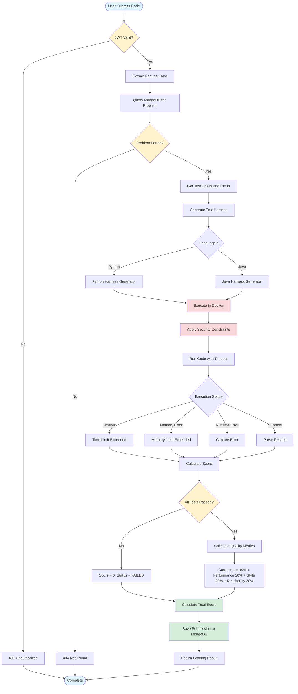

 # LintLoop

Full-stack coding practice platform with automated code grading focused on style, readability, and performance.

## Features

- 10-15 curated coding problems
- Real-time code execution with Docker isolation
- Automated grading system:
  - Correctness (passes all test cases)
  - Performance (execution time and space complexity)
  - Style (linting score via Pylint/ESLint)
  - Readability (complexity metrics and code quality)
- Web application with Monaco code editor
- Mobile app built with React Native
- Secure code execution environment

## Tech Stack

**Backend:**
- Node.js + Express + TypeScript
- MongoDB
- Docker for secure code execution
- Pylint/ESLint for style checking

**Frontend:**
- React with Monaco Editor
- Tailwind CSS

**Mobile:**
- React Native

## Getting Started

### Prerequisites
- Node.js 18+
- MongoDB (for local development)
- Docker

### Installation

1. Clone the repository
```bash
git clone https://github.com/Inesculent/LintLoop.git
cd LintLoop
```

2. Install backend dependencies
```bash
cd backend
npm install
```

3. Set up environment variables
```bash
copy .env.example .env
# Edit .env with your configuration
```

4. Start the development server
```bash
npm run dev
```

The API will be available at http://localhost:5000

## Development

```bash
# Run in development mode with auto-reload
npm run dev

# Build TypeScript
npm run build

# Run production build
npm start
```

## Deployment

Automatic deployment via GitHub Actions to DigitalOcean on every push to main branch.

## API Endpoints

- `GET /` - API information
- `GET /health` - Health check
- `GET /api/problems` - List all problems
- `POST /api/submissions` - Submit code for grading
- `POST /api/execute` - Execute code
- `GET /api/test` - Test endpoint

## Grading System

Code submissions are graded on four criteria:

1. **Correctness (40%)** - Must pass all test cases
2. **Performance (20%)** - Execution time and memory usage
3. **Style (20%)** - Linting score and code conventions
4. **Readability (20%)** - Cyclomatic complexity and maintainability

## Project Structure

```
LintLoop/
├── backend/
│   ├── dist/              # Compiled JavaScript
│   ├── server.ts
│   ├── routes/
│   ├── models/
│   ├── controllers/
│   ├── middleware/
│   ├── types/
│   └── utils/
├── frontend/
│   └── src/
├── mobile/
└── README.md
```

## Diagrams



## License

MIT
